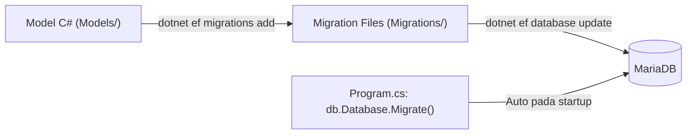
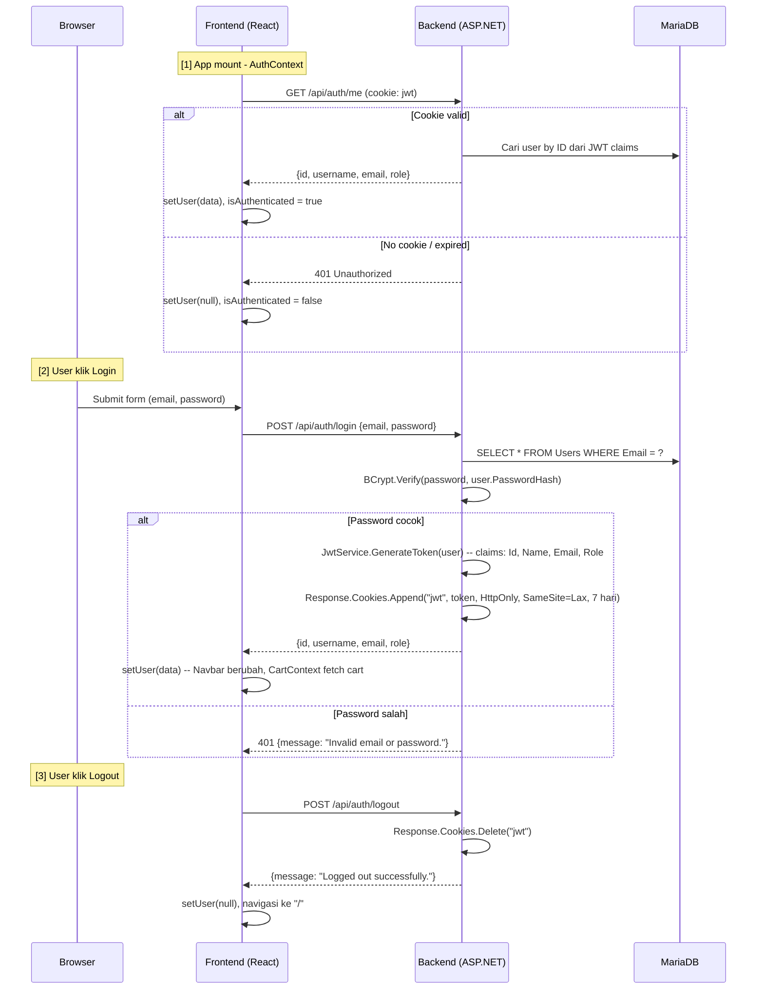
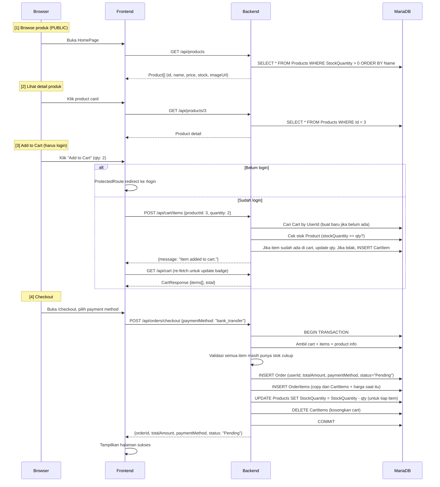
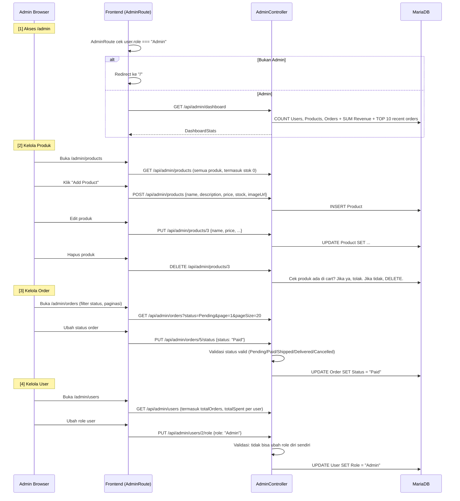
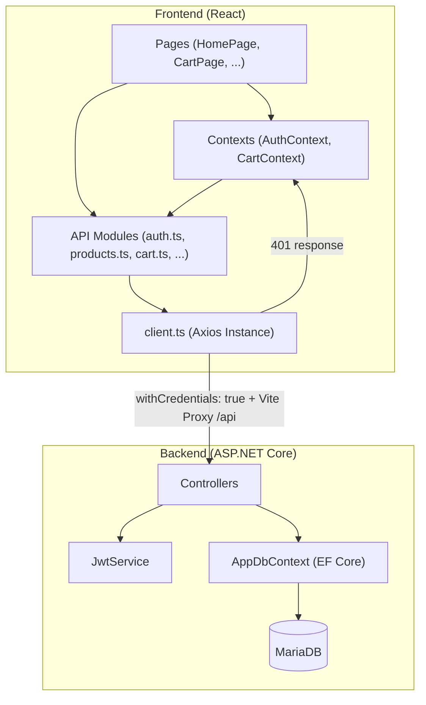

# Panduan Lengkap KBP Store eCommerce

---

## 1. Panduan Deployment

### 1.1 Prerequisites

| Tool | Versi | Instalasi |
|---|---|---|
| **.NET SDK** | 8.0+ | [dotnet.microsoft.com](https://dotnet.microsoft.com) |
| **Bun** | latest | `curl -fsSL https://bun.sh/install \| bash` |
| **MariaDB** | 10.x+ | `sudo apt install mariadb-server` |
| **dotnet-ef** (opsional) | 8.x | `dotnet tool install --global dotnet-ef` |

### 1.2 Setup Database

```bash
# Login ke MariaDB
sudo mysql -u root -p

# Buat database (jika belum ada)
CREATE DATABASE db_kdb;
```

> [!NOTE]
> Database tidak perlu dibuat manual jika menggunakan auto-migrate — EF Core akan membuatnya otomatis saat backend pertama kali dijalankan.

### 1.3 Konfigurasi Environment

**Backend** — [backend/.env](backend/.env):
```env
DB_CONNECTION=server=localhost;user=root;password=root;database=db_kdb
JWT_SECRET=super-secret-jwt-key-for-ecommerce-app-2024-kbp
JWT_ISSUER=ecommerce-api
JWT_AUDIENCE=ecommerce-frontend
CORS_ORIGIN=http://localhost:5173
```

**Frontend** — [frontend/.env](frontend/.env):
```env
VITE_API_BASE_URL=/api
```

### 1.4 Menjalankan di Development Mode

```bash
# Terminal 1 — Backend (port 5113)
cd backend
dotnet run

# Terminal 2 — Frontend (port 5173)
cd frontend
bun install
bun run dev
```

Buka browser di `http://localhost:5173`. Vite Proxy di [vite.config.ts](frontend/vite.config.ts) mem-forward semua request `/api/*` ke backend di `http://localhost:5113`.

### 1.5 Deploy Script (Production)

Jalankan [deploy.sh](deploy.sh):

```bash
chmod +x deploy.sh
./deploy.sh
```

Script ini melakukan 4 tahap:

| Tahap | Perintah | Output |
|---|---|---|
| 1. Build Frontend | `bun install && bun run build` | `frontend/dist/` |
| 2. Publish Backend | `dotnet publish -c Release` | `publish/` |
| 3. Apply Migrations | `dotnet ef database update` | Schema DB terupdate |
| 4. Restart Services | Manual (systemd/nginx) | Server aktif |

Setelah build, jalankan manual:
```bash
# Backend
cd publish && dotnet backend.dll

# Frontend (serve static files dari dist/)
cd frontend && bun run preview
# atau copy dist/ ke Nginx web root
```

### 1.6 Akun Default (Seed Data)

| Role | Email | Password |
|---|---|---|
| Admin | `admin@kbp.com` | `admin123` |
| User | `user@kbp.com` | `password123` |

> [!IMPORTANT]
> Akun ini dibuat otomatis saat backend pertama kali dijalankan (lihat seeder di [Program.cs](backend/Program.cs)). Password di-hash menggunakan **BCrypt**.

---

## 2. Database Migration

### 2.1 Cara Kerja EF Core Code-First

Aplikasi ini menggunakan **EF Core Code-First** — artinya schema database dibuat dari model C#, bukan sebaliknya.



### 2.2 Migration Files yang Ada

```
backend/Migrations/
  |- 20260318031849_InitialCreate.cs       -- Tabel: Users, Products, Carts, CartItems, Orders, OrderItems + Seed Products
  |- 20260318040246_AddUserRole.cs          -- Tambah kolom Role ke tabel Users
  |- AppDbContextModelSnapshot.cs           -- Snapshot state terakhir
```

### 2.3 Auto-Migrate (Saat Startup)

Di [Program.cs](backend/Program.cs) baris 88:

```csharp
db.Database.Migrate();  // Jalankan semua migration yang belum di-apply
```

Ini artinya **setiap kali backend dijalankan**, semua migrasi pending akan otomatis di-apply. Tidak perlu menjalankan migration manual.

### 2.4 Perintah Migration Manual

Jika ingin mengelola migrasi secara manual:

```bash
cd backend

# Buat migration baru setelah mengubah model
dotnet ef migrations add NamaMigration

# Apply semua migration ke database
dotnet ef database update

# Rollback ke migration tertentu
dotnet ef database update NamaMigrasiSebelumnya

# Hapus migration terakhir (jika belum di-apply)
dotnet ef migrations remove

# Generate SQL script (untuk production)
dotnet ef migrations script -o migration.sql
```

### 2.5 Seed Data

Product seed didefinisikan di [AppDbContext.cs](backend/Data/AppDbContext.cs) via `HasData()` — 6 produk awal. User seed ada di `Program.cs` via `SeedDefaultUsersAsync()` — admin + user.

---

## 3. Flow Aplikasi: Frontend ke Backend

### 3.1 Mapping Komponen ke API Endpoint

#### Public (Tanpa Login)

| Frontend | API Call | Backend Handler |
|---|---|---|
| [HomePage.tsx](frontend/src/pages/HomePage.tsx) | `GET /api/products` | [ProductsController.GetAll](backend/Controllers/ProductsController.cs#L20-L36) |
| [ProductDetailPage.tsx](frontend/src/pages/ProductDetailPage.tsx) | `GET /api/products/{id}` | [ProductsController.GetById](backend/Controllers/ProductsController.cs#L38-L57) |
| [LoginPage.tsx](frontend/src/pages/LoginPage.tsx) | `POST /api/auth/login` | [AuthController.Login](backend/Controllers/AuthController.cs#L48-L64) |
| [RegisterPage.tsx](frontend/src/pages/RegisterPage.tsx) | `POST /api/auth/register` | [AuthController.Register](backend/Controllers/AuthController.cs#L27-L47) |

#### Protected (Harus Login)

| Frontend | API Call | Backend Handler |
|---|---|---|
| [CartPage.tsx](frontend/src/pages/CartPage.tsx) | `GET /api/cart` | [CartController.GetCart](backend/Controllers/CartController.cs#L26-L53) |
| ProductDetail / CartPage | `POST /api/cart/items` | [CartController.AddItem](backend/Controllers/CartController.cs#L55-L101) |
| CartPage (update qty) | `PUT /api/cart/items/{productId}` | [CartController.UpdateItem](backend/Controllers/CartController.cs#L104-L131) |
| CartPage (hapus item) | `DELETE /api/cart/items/{productId}` | [CartController.RemoveItem](backend/Controllers/CartController.cs#L133-L153) |
| [CheckoutPage.tsx](frontend/src/pages/CheckoutPage.tsx) | `POST /api/orders/checkout` | [OrdersController.Checkout](backend/Controllers/OrdersController.cs#L26-L107) |
| [OrderHistoryPage.tsx](frontend/src/pages/OrderHistoryPage.tsx) | `GET /api/orders` | [OrdersController.GetOrders](backend/Controllers/OrdersController.cs#L109-L138) |

#### Admin Only (Role = Admin)

| Frontend | API Call | Backend Handler |
|---|---|---|
| [DashboardPage.tsx](frontend/src/pages/admin/DashboardPage.tsx) | `GET /api/admin/dashboard` | [AdminController.GetDashboard](backend/Controllers/AdminController.cs#L25-L56) |
| [ProductsAdminPage.tsx](frontend/src/pages/admin/ProductsAdminPage.tsx) | `GET/POST/PUT/DELETE /api/admin/products` | AdminController (Products CRUD) |
| [OrdersAdminPage.tsx](frontend/src/pages/admin/OrdersAdminPage.tsx) | `GET /api/admin/orders` + `PUT /status` | AdminController (Orders) |
| [UsersAdminPage.tsx](frontend/src/pages/admin/UsersAdminPage.tsx) | `GET /api/admin/users` + `PUT /role` | AdminController (Users) |

### 3.2 Flow Detail: Autentikasi



**Logic di Backend:**
1. **Register** — Validasi email/username unik, hash password dengan `BCrypt.Net.BCrypt.HashPassword()`, simpan ke DB
2. **Login** — Cari user by email, verifikasi dengan `BCrypt.Net.BCrypt.Verify()`, generate JWT, set HttpOnly cookie
3. **Me** — Extract userId dari JWT claims, kembalikan data user
4. **Proteksi route** — Middleware JWT membaca cookie `"jwt"` di `OnMessageReceived`, validasi signature/expiry/issuer/audience

### 3.3 Flow Detail: Belanja dan Checkout



**Logic Checkout — Detail Step-by-Step:**
1. Terima `paymentMethod` dari frontend
2. Ambil cart user beserta items dan data produk (`Include + ThenInclude`)
3. Validasi cart tidak kosong
4. Cek stok semua produk — jika ada yang tidak cukup, tolak (return nama produk yang stoknya kurang)
5. **Mulai database transaction** (`BeginTransactionAsync`)
6. Hitung `totalAmount` = SUM(price * quantity) menggunakan LINQ
7. Buat record `Order` baru
8. Copy setiap `CartItem` → `OrderItem` (dengan `UnitPrice` saat itu)
9. Kurangi `StockQuantity` setiap produk
10. Hapus semua `CartItem` dari cart
11. **Commit transaction** — jika gagal, rollback otomatis

### 3.4 Flow Detail: Admin Panel



### 3.5 Koneksi Frontend ke Backend: API Layer



**Alur request dari klik button sampai data tampil:**
1. User klik button di **Page** component
2. Page memanggil fungsi dari **Context** (misal `addItem()` dari `CartContext`)
3. Context memanggil fungsi dari **API module** (misal `cartApi.addItem()`)
4. API module menggunakan **Axios client** (`client.ts`) yang sudah dikonfigurasi `withCredentials: true`
5. Axios mengirim request ke `/api/...` — Vite Proxy forward ke backend `http://localhost:5113/api/...`
6. Backend **Controller** menerima request, extract userId dari JWT cookie claims
7. Controller menggunakan **AppDbContext** (EF Core + LINQ) untuk query/mutasi database
8. Response dikembalikan ke frontend, Context update state, Page re-render

### 3.6 Proteksi Route

| Layer | Mekanisme | File |
|---|---|---|
| **Frontend** — User biasa | `ProtectedRoute` — cek `isAuthenticated`, redirect ke `/login` | [ProtectedRoute.tsx](frontend/src/components/ProtectedRoute.tsx) |
| **Frontend** — Admin | `AdminRoute` — cek `user.role === "Admin"`, redirect ke `/` | [AdminRoute.tsx](frontend/src/components/AdminRoute.tsx) |
| **Backend** — User biasa | `[Authorize]` attribute pada Cart & Orders controller | Middleware JWT |
| **Backend** — Admin | `[Authorize(Roles = "Admin")]` pada AdminController | Middleware JWT + Role check |
| **401 Handler** | Axios interceptor dispatch `auth:unauthorized` event, AuthContext clear user | [client.ts](frontend/src/api/client.ts) |
